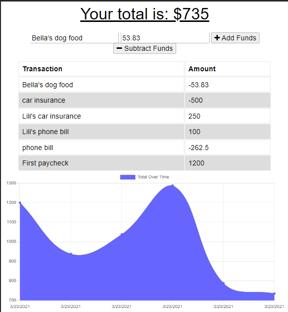

# Budget_Buddy

## Description
Don't want to live above oyur means? Budget Buddy's got your back! This application allows you to track all the monetary flow, in and out, so that you can be aware of how much you're earning and how much you're spending so you can make more mindful plans!

## Table of Contents

* [Installation](#installation)
* [Usage](#usage)
* [Credits](#credits)
* [Contributing](#contributing)
* [License](#license)
* [Questions](#questions)

## Installation
`npm install` in the terminal will install all required packages for this app to work. 

## Usage
`npm start`, `node server.js`, or `nodemon server.js` can be used after installing packages to run the application.

Please follow the following link to the application!
[Budget Buddy Deployed App](https://protected-dawn-25034.herokuapp.com/)

## Credits

The gracious TA's and Aliyah of BCS and group 2 for the support.

### Contributing

Hit me up or just clone the repo and do your thing!
        
        
### Licenses

    ISC License

Copyright (c) 2021, 

Permission to use, copy, modify, and/or distribute this software for any
purpose with or without fee is hereby granted, provided that the above
copyright notice and this permission notice appear in all copies.

THE SOFTWARE IS PROVIDED "AS IS" AND THE AUTHOR DISCLAIMS ALL WARRANTIES
WITH REGARD TO THIS SOFTWARE INCLUDING ALL IMPLIED WARRANTIES OF
MERCHANTABILITY AND FITNESS. IN NO EVENT SHALL THE AUTHOR BE LIABLE FOR
ANY SPECIAL, DIRECT, INDIRECT, OR CONSEQUENTIAL DAMAGES OR ANY DAMAGES
WHATSOEVER RESULTING FROM LOSS OF USE, DATA OR PROFITS, WHETHER IN AN
ACTION OF CONTRACT, NEGLIGENCE OR OTHER TORTIOUS ACTION, ARISING OUT OF
OR IN CONNECTION WITH THE USE OR PERFORMANCE OF THIS SOFTWARE.
   

### Questions

For any additional questions:

email me

github: [gabel35](https://github.com/gabel35)

email: GabrielJose3135@gmail.com
        

-------------

Thank you!

        